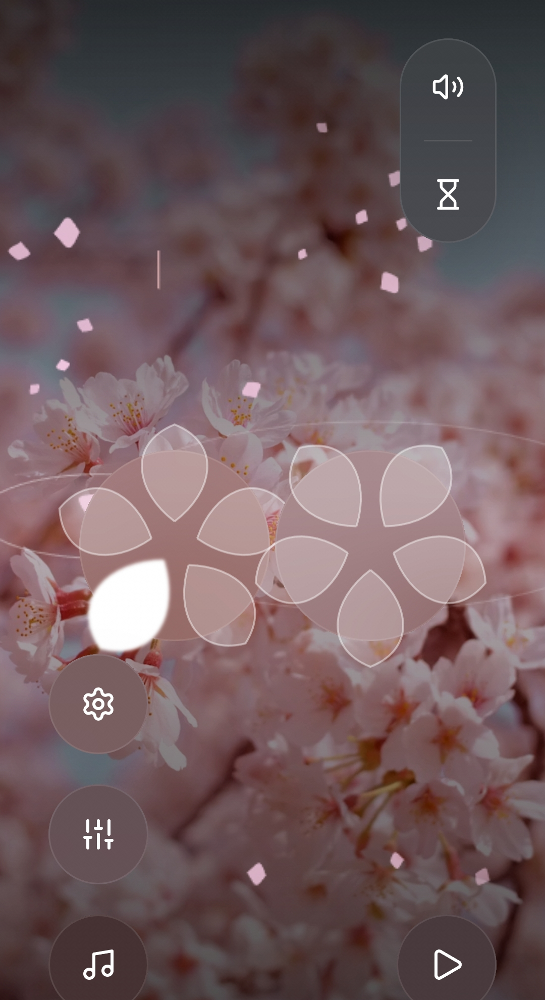

# 桜雨 – SakuraAme 🌸☔

桜と雨、そしてやさしい音。  
静かな時間のための、ミニマルなサウンドアプリです。

SakuraAme は **完全無料・広告なし** で、
PWA（Webアプリ）として公開されています。

---

## できること

- 🌧️ 雨音とタングドラムの音を楽しむ
- 🌸 視覚的にも落ち着く、和風ミニマルUI
- 📱 Android / PC でアプリのようにインストール可能

作業中、読書中、眠る前など、  
「音だけ欲しい時間」にそっと寄り添うことを目指しています。

---

## 使い方（PWA）

### PC（Chrome）
1. 下記URLを開く  
2. アドレスバーの「インストール」アイコンをクリック

### Android（Chrome）
1. 下記URLを開く  
2. メニュー →「ホーム画面に追加」  
3. アプリとして起動できます

🔗 **https://madobeno.github.io/sakuraame-pwa/**

---

## 技術メモ（開発者向け）

- React
- Tailwind CSS（CDN）
- PWA / Service Worker
- GitHub Pages

---

## ライセンス

This project is released under the MIT License.

---

静かな時間を、どうぞ。

